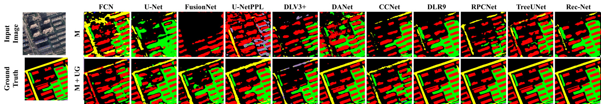

## Preparations
### 1. Download Codes
    $ git clone https://github.com/kyungsu-lee-ksl/USIM-GATE
    $ cd USIM-GATE-main


### 2. Primary Environment

#### A. Tensorflow 1

USIM and USIM-Gate have been developed using TensorFlow 1, but most of the functions of Tensorflow have been deprecated. The dependency would be under _TensorFlow-GPU_ _1.14_ version.

* Python dependency 

```
$ python -m pip install tensorflow-gpu==1.14
$ python -m pip install opencv-python
```

* GPU Acceleration
  * Cuda ([CUDA Toolkit Archive](https://developer.nvidia.com/cuda-toolkit-archive))
  * cuDNN ([NVIDIA Developer](https://developer.nvidia.com/))


Check Installation

    import tensorflow

    print(tensorflow.__version__)
    print(tensorflow.Session())


<br />

#### B. Tensorflow 2

ASH activation function was primarily implemented using Conda and TensorFlow 2 in the environment of Apple Silicon Chip. The dependency would be under _tensorflow-metal_ and _tensorflow-macos_.

    # xcode dependency
    $ xcode-select --install

    # opencv-python dependency
    $ conda install -c conda-forge opencv

    # Conda & Tensorflow dependency
    $ conda install -c apple tensorflow-deps==2.8.0

    # Additional Conda Library
    $ conda install pydot
    $ conda install graphviz

    # Tensorflow Dependency
    $ python -m pip install tensorflow-macos==2.8.0
    $ python -m pip install tensorflow-metal==0.4.0


Check Installation

    import tensorflow

    print(tensorflow.__version__)
    print(tensorflow.test.is_built_with_cuda())

<br />


#### C. PyTorch

Conda install

    $ conda install pytorch torchvision torchaudio cpuonly -c pytorch
    $ conda install pytorch torchvision torchaudio cudatoolkit=11.3 -c pytorch

PIP install

    python -m pip install pytorch torchvision torchaudio cpuonly


* GPU Acceleration [(HomePage)](https://pytorch.org/)
  * Cuda ([CUDA Toolkit Archive](https://developer.nvidia.com/cuda-toolkit-archive))
  * cuDNN ([NVIDIA Developer](https://developer.nvidia.com/))


Check Installation

    import torch

    print(torch.__version__)
    print(torch.cuda.is_available())


<br>


## Usage Example
### 1. Tensorflow 1


### 2. Tensorflow 2


### 3. PyTorch

<br>


# Datasets

## A. LoveDA Dataset

<p align="center">
  
</p>

* Abstract

The LoveDA dataset~\cite{wang2021loveda} covers 5,987 high spatial resolution (0.3m) remote sensing images from Nanjing, Changzhou, and Wuhan
Focus on different geographical environments between Urban and Rural Advance both semantic segmentation task. The LoveDA dataset contains 2,522 images of which size is 224 $\times$ 224 but randomly cropped so that a total number of 20,000 images are constructed for the WHU dataset.


* Dataset Download

  * [LoveDA](https://github.com/Junjue-Wang/LoveDA)
  


#### Related paper

  [[Paper]](https://arxiv.org/abs/2110.08733) [[Code]](https://github.com/Junjue-Wang/LoveDA) Wang, J., Zheng, Z., Ma, A., Lu, X., & Zhong, Y. (2021). LoveDA: A remote sensing land-cover dataset for domain adaptive semantic segmentation. arXiv preprint arXiv:2110.08733.

> ```
> @article{wang2021loveda,
>   title={LoveDA: A remote sensing land-cover dataset for domain adaptive semantic segmentation},
>   author={Wang, Junjue and Zheng, Zhuo and Ma, Ailong and Lu, Xiaoyan and Zhong, Yanfei},
>   journal={arXiv preprint arXiv:2110.08733},
>   year={2021}
> }
> ```


<br />

##


## B. KUD Dataset

* Abstract

The Korean Urban Dataset (KUD) is consist of aerial images over the area of Seoul, Suwon, Anyang, Gwacheon, and Goyang~\cite{kim2018objects}. The labeled data were obtained by changing vector data provided by the government agency of National Geographic Information Institute to images using Quantum GIS, a free and open-source GIS application. These data are more accurate than the ones from the OSM because they have been made by experts for many years. As changing a data format of the labeled data, the data are labeled into four classes: background, building, road, and water. Our data set, as shown in Fig. 2, consists of pairs of RGB images with 0.51m spatial resolution and labeled images. The data set covers an area of 551$\text{km}^2$ and is randomly divided into an area of 486.5$\text{km}^2$ for training and 64.5$\text{km}^2$ for testing. All the data were divided into multiple images with the pixel size of 224 $\times$ 224, of which 72,400 images were assigned to the training set and 9,600 to the test set. Likewise, these images were divided into a training, a validation, and a test set for the \textit{k}-fold cross-validation ($k=10$), regarding the cities.


* Dataset Download

  * KUD dataset: Due to a national policy, please request dataset via [email (Kyungsu Lee)](mailto:ks_lee@dgist.ac.kr)


<br />

##

# [PAPER] USIM and USIM-GATE

## 1. Formulation of USIM

<p align="center">
    
</p>

__[USIM]__ USIM is designed to simultaneously include a merging and an upsampling operator to replace the operators such as concatenation and addition blocks. To this end, the USIM alternately arranges the pixels of two input feature maps into the output feature map (merge), which has twice the height and width of input feature maps (upsample). Therefore, the USIM using two input feature maps ($F^{(i)} \in \mathbb{R}^{H \times W \times C}$ and $F^{(j)} \in \mathbb{R}^{H \times W \times C}$) generates the feature map ($F^{(k)} = F^{(i)} \circledast F^{(j)} = \textit{USIM}(F^{(i)}, F^{(j)})$), such that $F^{(k)} \in \mathbb{R}^{2H \times 2W \times C}$. Here, the USIM is channel-wise operator and thus $f^{(i)}_{h, w}, f^{(j)}_{h, w}, f^{(k)}_{h, w} \in \mathbb{R}^C$. Note that, the USIM is a binary operation such as addition and multiplication, not a trainable operator like convolution.

## 2. Formulation of USIM-GATE

<p align="center">
    
</p>

__[USIM-GATE]__ Pipeline of the USIM Gate (UG). The Attention Gate generates the output computed using the Hadamard product of spatial attention coefficient ($\alpha$) and the feature map generated by USIM ($F^{(i)} \circledast F^{(j)}$). As illustrated in the figure, using two feature maps ($F^{(i)}, F^{(j)} \in \mathbb{R}^{H \times W \times C}$), one output feature map is generated by the UG. In the upper stream, $F^{(i)}$ and $F^{(j)}$ are merged by concatenation ($F^{(i)} \odot F^{(j)} \in \mathbb{R}^{H \times W \times 2C}$), and the merged feature map is upsampled by the deconvolution, which is denoted as $\textit{deconv}: \mathbb{R}^{H \times W \times 2C} \rightarrow \mathbb{R}^{2H \times 2W \times C}$. In contrast, in the lower stream, $F^{(i)}$ and $F^{(i)}$ are merged and upsampled by the USIM such that the feature map ($F^{(i)} \circledast F^{(j)} \in \mathbb{R}^{2H \times 2W \times C}$) is generated.

##


<br>
<br>

# [PAPER] USIM Gate: UpSampling Module for Segmenting Precise Boundaries concerning Entropy

## Conference

This paper is accepted in Artificial Intelligence and Statistics 2023 Conference.

## Authors
Kyungsu Lee, Haeyun Lee, and Jae Youn Hwang*

{ks_lee, haeyun, jyhwang}@dgist.ac.kr

## Abstract
Deep learning (DL) techniques for the precise semantic segmentation have remained a challenge because of the vague boundaries of target objects caused by the low resolution of images. Despite the improved segmentation performance using up/downsampling operations in early DL models, conventional operators cannot fully preserve spatial information and thus generate vague boundaries of target objects. Therefore, for the precise segmentation of target objects in many domains, this paper presents two novel operators: (1) upsampling interpolation method (USIM), an operator that upsamples input feature maps and combines feature maps into one while preserving the spatial information of both inputs, and (2) USIM gate (UG), an advanced USIM operator with boundary-attention mechanisms. We designed our experiments using aerial images where the boundaries critically influence the results. Furthermore, we verified the feasibility that our approach effectively segments target objects using Cityscapes dataset. The experimental results demonstrate that using the USIM and UG with state-of-the-art DL models can improve the segmentation performance with clear boundaries of target objects (Intersection over Union: +6.9\%; Boundary Jaccard: +10.1\%). Furthermore, mathematical proofs verify that the USIM and UG contribute to the handling of spatial information.


## Experimental Results

### 1. Quantitative Results

<p align="center">
    
</p>

__[Ablation Study]__ Average IoU and BJ score of the baseline model ($M$) with merging operators including USIM Gate (UG), Attention Gate (AG), USIM, concatenation, and residual block on Inria and WHU benchmark.


<p align="center">
    
</p>

<p align="center">
    
</p>

__[Quantitative analysis on KUD and LoveDA datasets]__ The best performing model with the UG was compared with other DL models in the multi-object segmentation datasets of LoveDA and KUD. In both datasets, as illustrated in Tables, the best performing model (ours), which was implemented using TreeUNet with the UG, exhibits SoTA performance as compared to any other DL models in all groups. The quantitative results show that the best model with the USIM achieved a 6.9% improved mIoU and a 10.1% BJ score as compared to other DL models.

### 2. Qualitative Results

#### A. KUD Dataset

<p align="center">
    
</p>
<p align="center">
    
</p>
<p align="center">
    
</p>
<p align="center">
    
</p>

#### B. LoveDA Dataset

<p align="center">
    
</p>
<p align="center">
    
</p>
<p align="center">
    
</p>
<p align="center">
    
</p>

#### C. Grad-CAM

<p align="center">
    
</p>

__[Grad-CAM-based Analysis]__ (a) Raw input image. (b) Ground truth for buildings (yellow) and roads (red). (c) Grad-CAM of $3^{\text{rd}}$-upsampling layer with deconvolution and concatenation (d) Grad-CAM of $3^{\text{rd}}$-upsampling layer with USIM, (e) Grad-CAM of $4^{\text{th}}$-upsampling layer with deconvolution and concatenation, and (f) Grad-CAM of $4^{\text{th}}$-upsampling layer with USIM. First two rows targeted building class and other two targeted roads class.


## Conclusion
In this study, we mathematically and experimentally demonstrated the outstanding performance of the USIM and UG. The USIM provides a better segmentation performance while preserving and increasing spatial information, and the UG exhibits boundary-attention-based feature extraction. The experimental results demonstrate that the best model with the UG significantly enhanced the segmentation performance. In the quantitative analysis, TreeUNet with the UG achieved 6.9\% and 10.1\% improved IoU and BJ scores as compared to other DL models for multi-objects segmentation. The main contribution of this study is the development of novel operators that can be implemented in any DL model with enhanced segmentation performance. However, finding the best hyperparameters is needed to further enhance the segmentation performance of the UG and other SoTA models. This aspect will be one of our future works.


## Citation
If you find our work useful in your research, please consider citing our paper:

```
@inproceedings{,
  title={},
  author={},
  booktitle={},
  pages={},
  year={2023},
  organization={}
}
```
